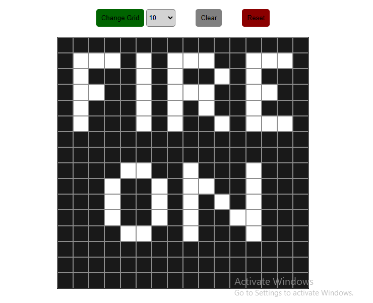

# Etch-A-Sketch Game

## Description
An app that allows user to draw on a board by clicking on each square on the board

## Table of Contents
- [Installation](#installation)
- [Usage](#usage)
- [Contributing](#contributing)
- [Contact](#contact)

## Installation

1. Clone the repository:
   git clone https://github.com/hencci/ETCH-A-SKETCH-2.git

2. Navigate to project folder
   cd ETCH-A-SKETCH-2

3. Open project on VS code
   code .

4. Open live server
   Right click on the index,html file, and click open live server

## Usage

- After srating the app, click on the specific squares to draw.
- Click change grid button to select and change the number 
  of squares on the board.
- Use clear button to clear the board.
- Use reset button to reset the board to the initial number of 
  squares.

### Screenshot

## Dependencies

- HTML
- CSS
- Javascript

## Contributing

1. Fork the repository.
2. Create a new branch (`git checkout -b feature-branch`).
3. Make your changes.
4. Commit your changes (`git commit -m 'Add new feature'`).
5. Push to the branch (`git push origin feature-branch`).
6. Open a pull request.

## Contact

Created by [Henry Moses](https://github.com/hencci)
Feel free to reach out if you have any questions.